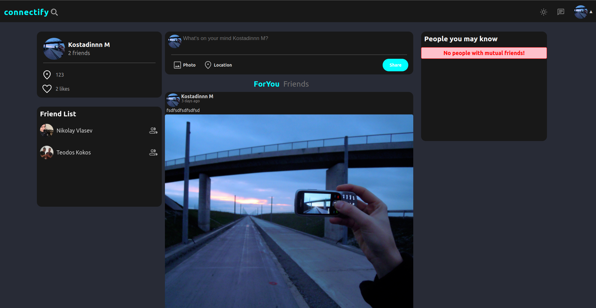

# Connectify | Social Network App

I tried in this project to build an application similar to Facebook but certainly does not have all the features, but it contains the basic features such as (create account, edit profile, friend requests, mutual friends, messages,search for users,posts and comments).

## Live Demo
[https://my-s-1f4d4.web.app/](https://my-s-1f4d4.web.app/)

## Project Screenshot

## Project Features:
- Fully responsive design (100%).
- Dark/Light theme.
- English language.
- Search in the navbar
- Messages: Chat engine with custom components.
- Friends: send request, accept/decline request ,remove friend
- Users: Sign Up/Login/Edit
- Posts: create, comment, like

## Technologies used in the project:
### 1- Backend:
    - using 'Firebase Authentication' to handle login/signup users.
    - using 'Firebase Firestore&Storage' to store data of the app (NoSQL database).

### 2- Frontend:
    - using 'React.js' to build the frontend of Connectify.
    - using 'React Hooks' to handle local state & 'React Context api' to handle global state in the app.
    - using 'Axios' to execute RestFull api requests for chat engine.
    - using 'firebase commands' to execute all  RESTful api requests for the app.
    - using 'Google React Places API' to execute the location search in the modal
    - using 'Chat Engine and its API' with custom components to create a nice looking and working chat that intergrades well with firebase
